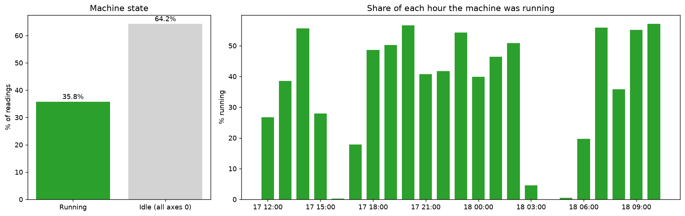
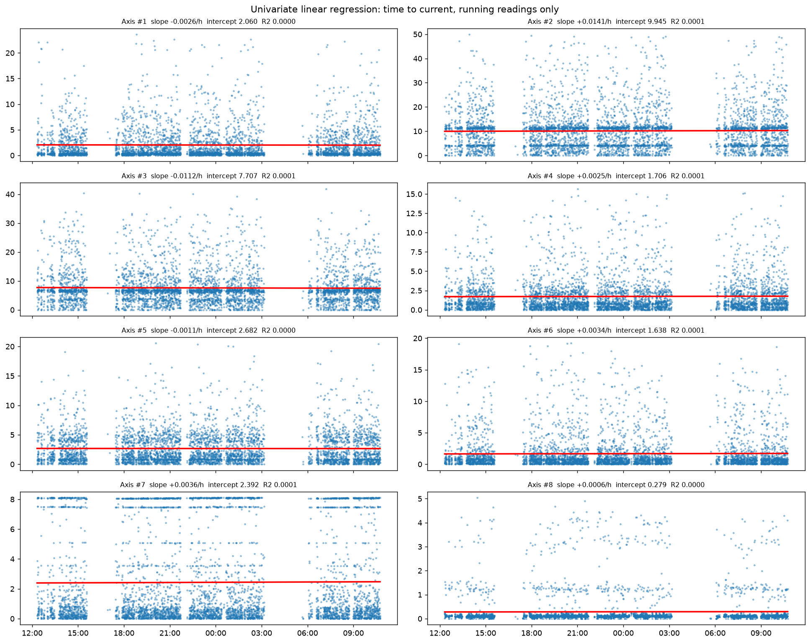
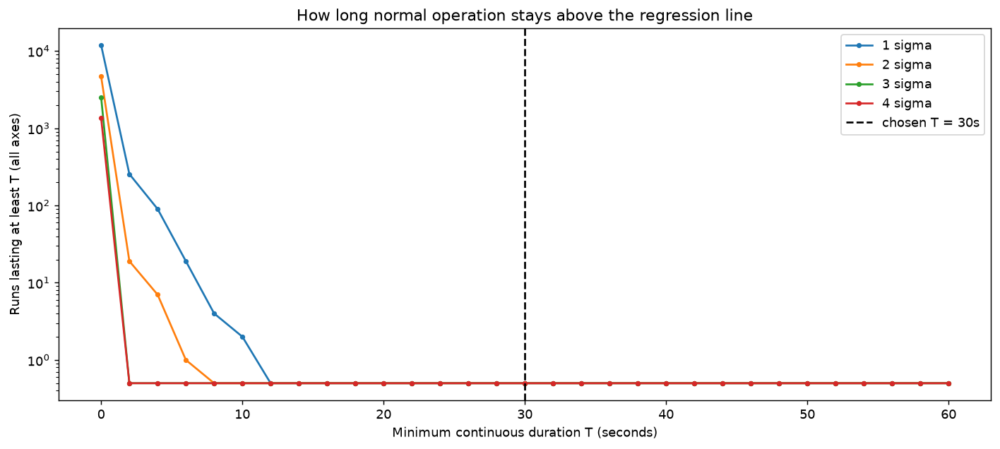
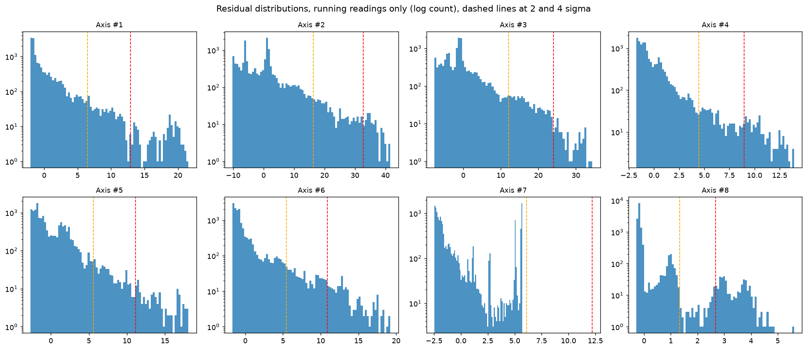
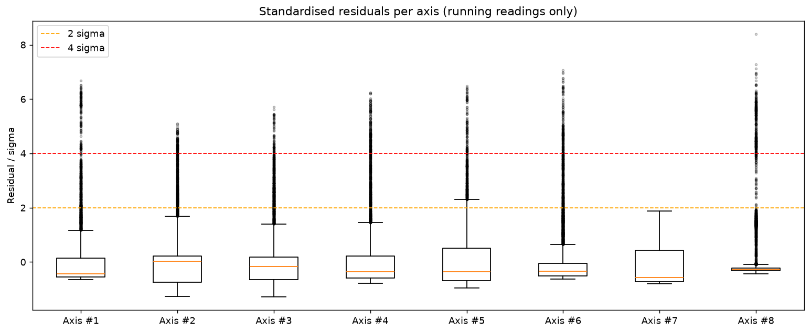
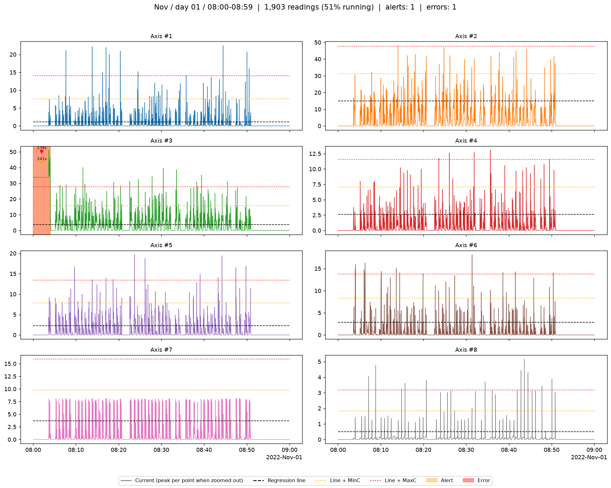
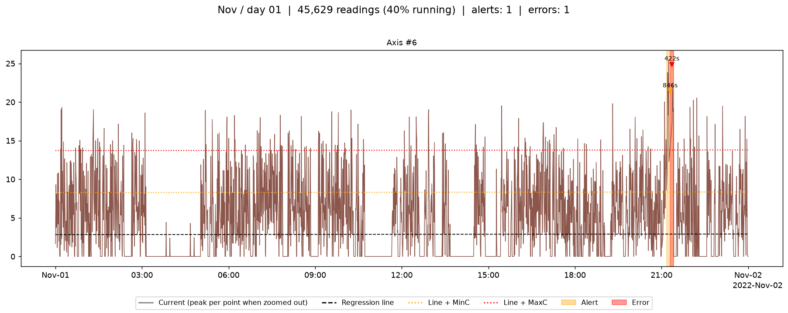
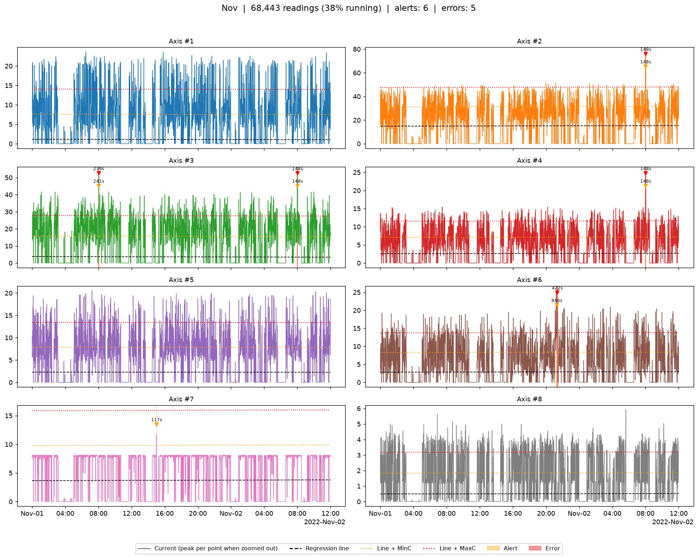

# Streaming Data for Predictive Maintenance with Linear Regression-Based Alerts

.env file sent via email

**Author:** Sultan Atanda (9114837)

Practical Lab 1, built on the Data Streaming Workshop pipeline. Robot current readings for eight axes are stored in a Neon PostgreSQL database. A linear regression (time to current) is trained per axis from the database on the readings where the machine is running, the residuals are used to discover alert and error thresholds, and a synthetic test stream is replayed through the database while an alert module watches it. Alerts and errors are logged to a CSV and a database table and shown on a dashboard with month, day and hour filters.
Practical Lab 1, built on the Data Streaming Workshop pipeline. Robot current readings for eight axes are stored in a Neon PostgreSQL database. A linear regression (time to current) is trained per axis from the database on the readings where the machine is running, the residuals are used to discover alert and error thresholds, and a synthetic test stream is replayed through the database while an alert module watches it. Alerts and errors are logged to a CSV and a database table and shown on a dashboard with month, day and hour filters.

## Repository layout

```
.
├── Practical_Lab_1.ipynb        main notebook (run top to bottom)
├── requirements.txt
├── .env                         Not committed (sent via email)
├── data/
│   ├── robot_data.csv           training data (Trait, Axis #1-#14, Time), 39,672 readings
│   ├── synthetic_test.csv       generated 48 h test stream
│   ├── synthetic_faults.csv     ground truth of the injected faults
│   └── alert_log.csv            alerts and errors logged by the last run
├── images/results/              plots produced by the notebook
└── src/
    ├── database_service.py      DatabaseService: Neon connection, tables, inserts, queries
    ├── regression_models.py     AxisRegression: one LinearRegression per axis, residuals
    ├── analysis.py              ResidualAnalyzer: residual plots, run lengths, threshold grids
    ├── synthetic_data.py        SyntheticDataGenerator: standardised, min-max scaled test data
    ├── alerts.py                AlertDetector (streaming rules) and EventLog (CSV + database)
    ├── streaming_simulator.py   StreamingSimulator: replays a CSV into the database
    └── dashboard.py             RobotDashboard: live view and filtered view
```

Every worker module is a class and its work is done through methods, so the notebook only orchestrates them.

## Setup

1. Python 3.12 or newer.
2. Create an environment and install the dependencies:

   ```
   python -m venv .venv
   source .venv/bin/activate        # Windows PowerShell: .\.venv\Scripts\Activate.ps1
   pip install -r requirements.txt
   python -m ipykernel install --user --name datastreamvisualization-lab --display-name "Python (.venv) - DataStreamVisualization"
   ```

   Activate `.venv` before running Python scripts or starting Jupyter. In a notebook, select the **Python (.venv) - DataStreamVisualization** kernel.
3. Create a free PostgreSQL database on [Neon](https://neon.tech), copy `.env.example` to `.env` and paste the connection string into `DATABASE_URL`.
4. Start Jupyter from the repository root (the notebook uses relative paths) and run `Practical_Lab_1.ipynb` from top to bottom:

   ```
   jupyter lab
   ```

The notebook creates the tables it needs (`lab1_training`, `lab1_stream`, `lab1_alert_events`) and loads `data/robot_data.csv` into `lab1_training` on first run. Loading is idempotent: rows already present are skipped.

## How it works

| Step | Class / method | What happens |
|---|---|---|
| 1 | `DatabaseService.load_csv`, `get_frame` | Training readings are stored in Neon and pulled back as a DataFrame. |
| 2 | `AxisRegression.fit` | Idle readings are dropped, then time (seconds since the first reading) is regressed against each axis. Slope, intercept and R2 are recorded. |
| 3 | `ResidualAnalyzer` | Residuals of the running readings are plotted, outliers counted, and the length of every continuous run above the line is measured. |
| 4 | `SyntheticDataGenerator.generate` | A 48 hour test stream is built from the training data: standardised to the training mean and standard deviation, min-max normalised to the training range, then faults are injected. |
| 5 | `StreamingSimulator.start_stream` | The test stream is replayed into `lab1_stream` in time order, each batch is passed to the detector, and the dashboard refreshes from the newest rows in the database. |
| 6 | `AlertDetector`, `EventLog` | Events are written to `data/alert_log.csv` and the `lab1_alert_events` table. |
| 7 | `RobotDashboard.interactive` | Filtered review of the stream with month, day, hour and axis selectors. |

### Idle readings are excluded

64.2% of the training readings have all eight axes at exactly 0, which means the machine was not working. Those readings say nothing about the current the axes draw while working, so they are left out of the regression, sigma, the residual plots, the boxplots and the threshold analysis (`AxisRegression.running_mask`). A reading counts as running when any axis is above 0; zeros on individual axes inside a running reading are real measurements and stay. Idle readings are still streamed and shown on the dashboard, where they sit below the regression line and end any run above it. With them included the line would sit at about a third of the working level and sigma would be inflated by the jump between 0 and working values.



### Regression models

Fitted on the 14,185 running readings:

| Axis | Slope (per hour) | Intercept | Residual sigma | MinC (2 sigma) | MaxC (4 sigma) |
|---|---|---|---|---|---|
| 1 | -0.00263 | 2.060 | 3.229 | 6.458 | 12.916 |
| 2 | +0.01412 | 9.945 | 8.171 | 16.341 | 32.683 |
| 3 | -0.01116 | 7.707 | 6.014 | 12.027 | 24.054 |
| 4 | +0.00255 | 1.706 | 2.237 | 4.474 | 8.947 |
| 5 | -0.00112 | 2.682 | 2.785 | 5.570 | 11.141 |
| 6 | +0.00342 | 1.638 | 2.722 | 5.445 | 10.890 |
| 7 | +0.00365 | 2.392 | 3.054 | 6.107 | 12.215 |
| 8 | +0.00062 | 0.279 | 0.669 | 1.339 | 2.678 |

The slopes are almost flat (R2 below 0.0002), so the line is the expected working level of each axis. Intercepts are at the first training reading. Units are those of the current readings in the source file.



### Alert and error rules

An event is raised per axis when the current stays at or above the regression line plus a limit for at least T seconds without interruption. A gap of more than 10 seconds between readings breaks a run.

| Rule | Condition |
|---|---|
| **Alert** | current >= regression line + MinC for >= T seconds continuously |
| **Error** | current >= regression line + MaxC for >= T seconds continuously |

Chosen values: **MinC = 2 sigma, MaxC = 4 sigma, T = 30 s**, where sigma is the residual standard deviation of the axis while running (table above). Sigma units are used because the axes differ in scale by more than a factor of ten.

### Why these thresholds

The thresholds were discovered from the healthy training data, not assumed.

- Among running readings, 3% to 6% per axis are at least 2 sigma above the line and 0.6% to 2.8% at least 4 sigma above it, so single readings are ordinary working peaks and the time condition has to do the filtering. Axis #7 saturates at 8.1, below its own line plus MinC, so on that axis an alert means the current went beyond its usual ceiling.
- The longest continuous run above the line in the training data is 11.5 s at 1 sigma, 6.1 s at 2 sigma and 2.0 s at 3 sigma; at 4 sigma no two consecutive readings qualify. **T = 30 s** is 2.6x the longest run at 1 sigma and 4.9x the longest at 2 sigma. The healthy data raises no event at T = 20 s or more for any level, and only 2 (at 1 and 1.5 sigma) if T were 10 s.
- **MinC = 2 sigma** is above the bulk of working operation (about 5% of running readings) and the longest healthy run there is 6.1 s, where 1 sigma (9% to 22% of running readings above it) has the longest healthy runs and the only healthy events.
- **MaxC = 4 sigma** is twice the alert level, reached by about 1% of running readings and never twice in a row in healthy data.

| Longest healthy run above the line | 1 sigma | 1.5 sigma | 2 sigma | 3 sigma | 4 sigma |
|---|---|---|---|---|---|
| seconds | 11.5 | 11.5 | 6.1 | 2.0 | 0.0 |



Residual distributions and boxplots (running readings only):





Replaying the same synthetic stream through detectors with other settings shows the trade-off (a "real" fault is at least 2 sigma high and at least 30 s long, 7 of the 9 injected). Because the baseline is fitted on running readings, none of the settings gives a false alarm on this healthy stream, so the table shows what each setting finds.

| MinC | MaxC | T | alerts | errors | false alarms | real faults found |
|---|---|---|---|---|---|---|
| 1 sigma | 3 sigma | 10 s | 9 | 7 | 0 | 7 / 7 |
| 1 sigma | 3 sigma | 30 s | 8 | 6 | 0 | 7 / 7 |
| 2 sigma | 4 sigma | 10 s | 8 | 6 | 0 | 7 / 7 |
| **2 sigma** | **4 sigma** | **30 s** | **7** | **5** | **0** | **7 / 7** |
| 2 sigma | 4 sigma | 60 s | 7 | 5 | 0 | 7 / 7 |
| 2 sigma | 4 sigma | 120 s | 5 | 5 | 0 | 5 / 7 |
| 3 sigma | 5 sigma | 30 s | 6 | 2 | 0 | 6 / 7 |
| 2 sigma | 6 sigma | 30 s | 7 | 0 | 0 | 7 / 7 |

T = 120 s misses the two faults shorter than two minutes, 3 and 5 sigma misses the 2.6 sigma fault, and MaxC = 6 sigma never raises an error. The lower settings also find everything here, but 1 sigma is where the healthy data has its longest runs and its only healthy events, so 2 sigma and 30 s keep a margin of several times over anything healthy.

### Synthetic test data

`SyntheticDataGenerator` receives the training DataFrame pulled from the database. It resamples one hour blocks of the training data (so the idle and running pattern is kept) with 3% jitter on non-zero readings, standardises each axis (z-scores mapped back to the training mean and standard deviation), min-max normalises against the training minimum and maximum, clips to that range, and then injects faults. A fault of k sigma lifts the axis to the regression line plus k sigma of that axis, the same scale the thresholds use. The result starts on 2022-10-31 12:00 UTC and lasts 48 hours, so it spans two months and three days for the dashboard filters.

Injected faults (also saved in `data/synthetic_faults.csv`): a 3 sigma step on Axis #2, a 20 s blip on Axis #5 (shorter than T), a 5 sigma step on Axis #3, a 2.6 sigma step on Axis #7, a ramp to 6 sigma over 25 minutes on Axis #6, a 1 sigma deviation on Axis #1 (below MinC), and a 4.5 sigma overload on Axes #2, #3 and #4 at the same time. The blip and the 1 sigma deviation are negative controls and must not raise events.

### Results on the synthetic stream

All 7 real faults are logged, both negative controls stay silent, and there are no false alarms in the 48 hours of healthy data. On the Axis #6 ramp the alert fires about 11 minutes into the ramp and the error about 7 minutes after that, which is the early-warning behaviour wanted for maintenance planning.

Events are stored in `data/alert_log.csv` and in the `lab1_alert_events` table with these columns: `level`, `axis`, `start`, `end`, `duration_s`, `peak_deviation`, `mean_deviation`, `limit_c`, `min_duration_s`.

### Dashboard

`RobotDashboard.interactive()` shows four drop-downs: **Month**, **Day**, **Hour** and **Axis**. The day list depends on the month and the hour list depends on the day. Each panel plots the current, the regression line, the regression line plus MinC and plus MaxC, and each alert or error as a shaded span with a marker annotated with its duration in seconds. The title shows the share of readings in the window that were running. Long windows are reduced to 2,500 points by keeping the peak of each bin.

The same filters can be called directly, for example `dashboard.show(month=11, day=1, hour=8)` or `dashboard.show(month=11, day=1, axis=6)`.

Hour view (Nov 1, 08:00-08:59):



Day view, Axis #6 ramp (Nov 1):



Month view (November):



During streaming, `show_live_dashboard()` draws the last two minutes of readings from the database with the regression lines and the current status (NORMAL, ALERT or ERROR).

## Limitations

- Thresholds come from a single day of data that is assumed healthy, and a reading is called idle only when all eight axes are exactly 0. The baseline should be refreshed after each verified maintenance.
- The faults are injected into synthetic data, so the detection results check that the rules behave as designed, not how well they predict real failures.
- Time is the only regression input, and idle readings are removed before fitting. Even among running readings the current swings between the phases of each work cycle, which is why the limits have to be several sigma wide.
- The two-day replay is compressed (500 readings per batch with a short pause) instead of running at the real 2 second cadence.
